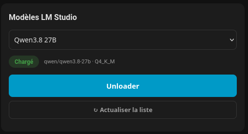
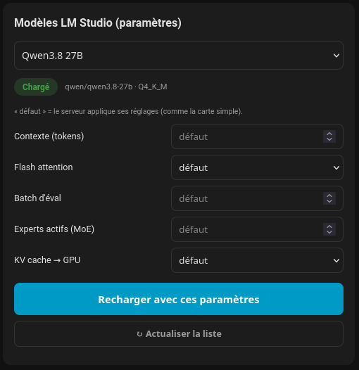

# LM Studio — Home Assistant integration

Manage **load / unload of models** on a local LM Studio server from Home Assistant.
No chat, no inference — just the lifecycle of your models, as first-class entities.

## What you get

| Entity | Meaning |
|--------|---------|
| `switch.<model>` (one per model) | **ON = loaded** on the LM Studio server, OFF = not loaded. Toggle it to load/unload. |
| `sensor.loaded_models` | Number of models currently loaded |
| `sensor.total_models` | Total models available on the server |
| `sensor.server` | `online` when the server responds |

Services (usable in automations):

| Service | Argument | Effect |
|---------|----------|--------|
| `lmstudio.load_model` | `model: "qwen/qwen3-8b"` + optional params (see below) | Load (only if currently not loaded) |
| `lmstudio.unload_model` | `model: "qwen/qwen3-8b"` | Unload (only if currently loaded) |
| `lmstudio.refresh` | — | Force a state refresh |

**Optional load parameters** (all optional — omit to let the server apply its
own defaults, exactly like the simple card):

| Param | Type | Meaning | Applies to |
|-------|------|---------|------------|
| `context_length` | int | Max context size (tokens) | all engines |
| `flash_attention` | bool | Flash attention (less VRAM, faster) | llama.cpp |
| `eval_batch_size` | int | Eval batch size | llama.cpp |
| `num_experts` | int | Active experts (MoE routing) | MoE models |
| `offload_kv_cache_to_gpu` | bool | KV cache in VRAM (false = RAM) | llama.cpp |

```yaml
- service: lmstudio.load_model
  data:
    model: qwen/qwen3.6-35b-a3b
    context_length: 16384
    flash_attention: true
    num_experts: 8
```

## Lovelace cards

Both cards ship in a **single JavaScript bundle** at the one resource path
(`custom_components/lmstudio/www/lmstudio-model-card/card.js`), which the
integration copies to `/homeassistant/www/lmstudio-model-card/card.js` at setup.
Because both custom-element definitions live in that one file — and that file is
registered as a Lovelace resource — **both cards appear in the card picker**:

- **`custom: lmstudio-model-card`** — the simple one. Model menu + **Load /
  Unload** + **Chargé / Déchargé** badge + **Refresh**. Loads with the server's
  default parameters (plus the optional global *Context length* config).

  

- **`custom: lmstudio-model-card-advanced`** — the advanced one. Same model
  menu + a **parameter panel** (`context_length`, `flash_attention`,
  `eval_batch_size`, `num_experts`, `offload_kv_cache_to_gpu`). Numbers are
  free text, booleans are dropdowns (défaut / oui / non), and the display
  starts on **defaults** — leave everything on « défaut » and it behaves like
  the simple card. The Load button sends the chosen parameters to
  `lmstudio.load_model` (if the model is already loaded it unloads then
  re-loads with the new parameters).

  

> If you upgrade from a version where only the simple card was present, **hard
> refresh** the browser (Ctrl/Cmd+Shift+R) so the updated bundle is loaded and
> the advanced card shows up in the picker.

## How it talks to LM Studio

Verified against the live API:

- **State**: `GET /api/v0/models` — each entry has a clean `state: loaded | not-loaded`.
- **Load**: `POST /api/v1/models/load` with `{"model": "<id>"}` in the JSON body.
- **Unload**: `POST /api/v1/models/unload` with `{"instance_id": "<id>"}`.

Pitfalls handled in code:

1. `Content-Type: application/json` set on every POST (without it LM Studio
   answers `Unsupported Media Type` and does nothing);
2. **load is not idempotent** — the integration only calls load when the model
   reports `not-loaded` (and vice-versa for unload);
3. Model ids contain a slash (`publisher/name`) which breaks path-style routes —
   ids are always passed in the JSON body, never in the URL;
4. After every action the state is re-read until it confirms the expected
   value (or 90 s timeout, then logged).

## Install (HACS)

1. HACS → Integrations → ⚙ → *Custom repositories* → add `https://github.com/thomasbidou/lmstudio`.
2. HACS → Integrations → **LM Studio** → Install.
3. Restart Home Assistant.

## Configure

Settings → Devices & Services → **Add integration** → *LM Studio* →

- **Server URL** — e.g. `http://192.168.100.72:1234` (tested before saving);
- **Timeout** (default 10 s), **Refresh interval** (default 60 s);
- **API token** (optional), **Context length on load** (optional — passed as
  `context_length` to `/models/load` when set);
- **Local models only** (optional) — a newline-separated allowlist of model ids
  (`publisher/name`). When non-empty, the integration exposes **only** those
  models: switches, sensors and the Lovelace card ignore everything else. This
  is the intended way to hide models that appear on the server via **LM Link**
  (the HTTP API has no local/linked field — the allowlist is the filter).
  Leave empty to keep every model on the server.

Options can be changed later from the entry's *Settings* (re-tested live).

## Example automation

```yaml
alias: "Load small model in the evening"
trigger:
  - platform: time
    at: "18:00:00"
action:
  - service: lmstudio.load_model
    data:
      model: qwen/qwen3-8b
```

## Notes

- **Dynamic model list** — the list of models mirrors the server at all times:
  a model added to LM Studio gets a switch automatically, and a model **deleted**
  from LM Studio loses its switch (and its card entry) on the next refresh —
  no integration reload needed. The Lovelace card's **Refresh** button forces
  that re-sync immediately (it calls the `lmstudio.refresh` service).
- **Loaded detection** — every switch is ON when its model is loaded on the
  server and OFF when not; the card badge shows **Chargé / Déchargé**.
- **Load / unload** — toggle the switch, or use the services
  `lmstudio.load_model` / `lmstudio.unload_model` in automations.
- **Local models only** (optional) — a newline-separated allowlist of model ids
  to expose only a subset (e.g. to hide models that appear via LM Link). Leave
  empty to keep every model on the server.
- One config entry = one LM Studio server. Multiple servers → multiple entries
  (global services act on the last entry — use the switches for per-server control).
- When the server is unreachable, all entities go `unavailable` (HA stays stable,
  the coordinator keeps retrying).
